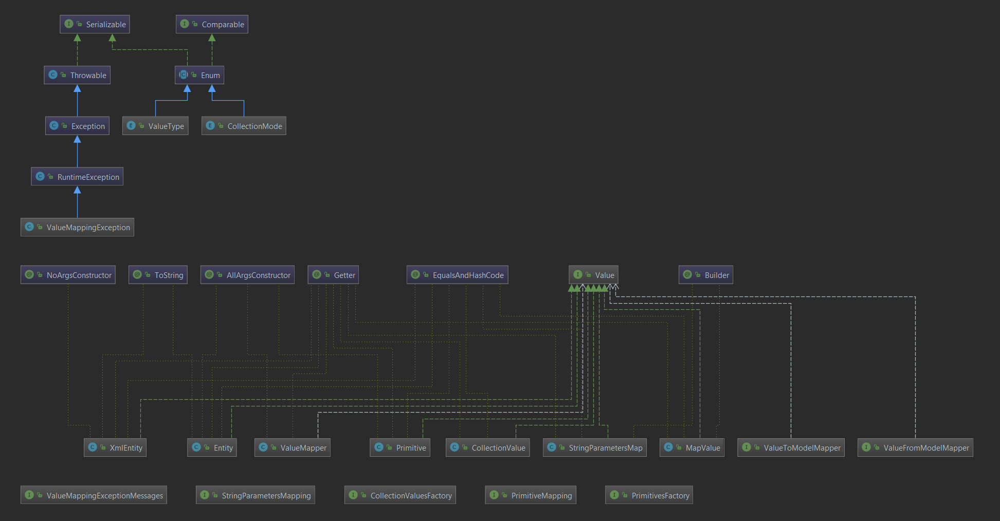

# ADK Модуль "application-entity"

## Назначение модуля
Данный модуль является хранилищем абстракций над различными видами данных.
Модуль включает в себя набор архитектурных классов, позволяющих оперировать множеством форматов данных как единой абстракцией.
Подобная универсальность достигается с помощью следующих классов:

Ключевые классы:
1. `Value` - интефрейс, который реализуется всеми обертками над данными
2. `Primitive` - обертка над Java примитивами, а также String. Содержит функционал парсинга строки
3. `CollectionValue` - обертка над Java коллекциями. Содержит функционал по работе как с массивами, так и с Collection
4. `Entity` - представляет собой пару `String -> Value`. Представляет собой аналог POJO в мире сущностей ADK
5. `XmlEntity` - представление XML в виде программного объекта. Позволяет проходит по нодам XML дерева, а также выполнять поиск.
6. `ValueMapper` - функциональный объект, выполняющий две задачи в зависимости от использования:
* `Value -> POJO`
* `POJO -> Value` 

Дополнительно, в модуле можно найти множество полезных "утильных" классов.

## Основная функция модуля:
Предоставление архитектурной модели сущностей для модулей-пользователей, а также функционального интерфейса маппинга.

## Особености конфигурации модуля
У модля нет конфигурации